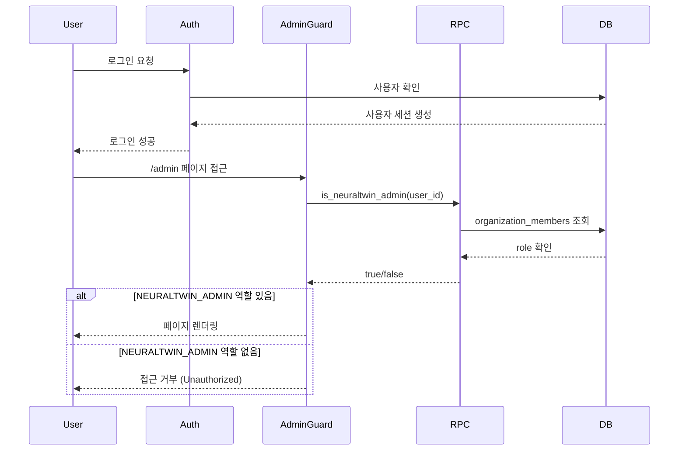

# NEURALTWIN HQ Admin Dashboard Architecture v2

> **최종 업데이트**: 2025-01-24  
> **프로젝트**: NEURALTWIN HQ Admin Dashboard  
> **도메인**: hq.neuraltwin.ai  
> **목적**: NEURALTWIN 내부 관리자를 위한 통합 관리 대시보드

---

## 목차

1. [개요](#1-개요)
2. [기술 스택](#2-기술-스택)
3. [데이터베이스 아키텍처](#3-데이터베이스-아키텍처)
4. [인증 및 권한 시스템](#4-인증-및-권한-시스템)
5. [프론트엔드 구조](#5-프론트엔드-구조)
6. [페이지 구조 및 기능](#6-페이지-구조-및-기능)
7. [컴포넌트 아키텍처](#7-컴포넌트-아키텍처)
8. [보안 정책](#8-보안-정책)
9. [향후 확장 계획](#9-향후-확장-계획)

---

## 1. 개요

### 1.1 프로젝트 목적

NEURALTWIN HQ Admin Dashboard는 NEURALTWIN 내부 직원이 전체 플랫폼을 관리하고 모니터링하기 위한 통합 관리 시스템입니다.

### 1.2 주요 기능

- **조직 관리**: 전체 고객 조직 조회, 관리, 모니터링
- **구독 관리**: 조직별 구독 플랜, 상태, 청구 주기 관리
- **라이선스 관리**: 라이선스 발급, 갱신, 만료 처리
- **사용량 모니터링**: API 호출, 스토리지, 시뮬레이션 사용량 추적
- **온톨로지 스키마 관리**: 공통 온톨로지 스키마 마스터 관리
- **ETL 파이프라인**: 데이터 파이프라인 모니터링 및 에러 관리
- **시스템 관리**: 시스템 상태 모니터링 및 오류 관리

### 1.3 접근 권한

- **대상 사용자**: NEURALTWIN 내부 직원만 접근 가능
- **역할 요구사항**: `NEURALTWIN_ADMIN` 역할 필수
- **보안**: 모든 페이지는 `AdminGuard`로 보호됨

---

## 2. 기술 스택

### 2.1 Frontend

```typescript
{
  "framework": "React 18.3.1",
  "routing": "react-router-dom 6.30.1",
  "build_tool": "Vite",
  "language": "TypeScript",
  "styling": "Tailwind CSS",
  "ui_library": "shadcn/ui + Radix UI",
  "state_management": "@tanstack/react-query 5.83.0",
  "charts": "recharts 2.15.4"
}
```

### 2.2 Backend

```typescript
{
  "database": "PostgreSQL (via Supabase)",
  "orm": "@supabase/supabase-js 2.84.0",
  "authentication": "Supabase Auth",
  "authorization": "Row Level Security (RLS) + Custom Functions"
}
```

### 2.3 Infrastructure

- **Hosting**: Lovable Cloud
- **Database**: Supabase PostgreSQL
- **Auth**: Supabase Auth
- **File Storage**: Supabase Storage (예정)

---

## 3. 데이터베이스 아키텍처

### 3.1 ERD (Entity Relationship Diagram)

```
┌─────────────────┐
│  organizations  │
├─────────────────┤
│ id (PK)         │
│ org_name        │
│ industry        │
│ country         │
│ website         │
│ is_active       │
│ created_at      │
│ updated_at      │
└─────────────────┘
         │
         │ 1:N
         ▼
┌──────────────────────┐
│ organization_members │
├──────────────────────┤
│ id (PK)              │
│ org_id (FK)          │
│ user_id              │
│ role (ENUM)          │
│ is_active            │
│ created_at           │
│ updated_at           │
└──────────────────────┘

┌─────────────────┐
│  subscriptions  │
├─────────────────┤
│ id (PK)         │
│ org_id (FK)     │
│ plan_type       │
│ status          │
│ store_quota     │
│ hq_seat_quota   │
│ billing_cycle   │
│ trial_end_date  │
│ created_at      │
│ updated_at      │
└─────────────────┘

┌─────────────────┐
│    licenses     │
├─────────────────┤
│ id (PK)         │
│ org_id (FK)     │
│ license_type    │
│ license_key     │
│ status          │
│ issued_at       │
│ expires_at      │
│ created_at      │
│ updated_at      │
└─────────────────┘

┌─────────────────┐
│  usage_metrics  │
├─────────────────┤
│ id (PK)         │
│ tenant_id (FK)  │
│ metric_type     │
│ metric_value    │
│ metric_unit     │
│ period_start    │
│ period_end      │
│ metadata        │
│ created_at      │
└─────────────────┘

┌─────────────────┐
│ activity_logs   │
├─────────────────┤
│ id (PK)         │
│ tenant_id (FK)  │
│ user_id         │
│ activity_type   │
│ description     │
│ metadata        │
│ created_at      │
└─────────────────┘

┌─────────────────┐
│     stores      │
├─────────────────┤
│ id (PK)         │
│ tenant_id (FK)  │
│ store_name      │
│ store_code      │
│ address         │
│ city, country   │
│ status          │
│ created_at      │
│ updated_at      │
└─────────────────┘
```

### 3.2 주요 테이블 상세

#### 3.2.1 organizations

```sql
CREATE TABLE public.organizations (
  id UUID PRIMARY KEY DEFAULT gen_random_uuid(),
  org_name TEXT NOT NULL,
  industry TEXT,
  country TEXT,
  website TEXT,
  created_at TIMESTAMPTZ NOT NULL DEFAULT now(),
  updated_at TIMESTAMPTZ NOT NULL DEFAULT now(),
  is_active BOOLEAN NOT NULL DEFAULT true
);
```

**용도**: 고객 조직 정보 저장

**주요 필드**:
- `org_name`: 조직명
- `industry`: 산업군
- `country`: 국가
- `is_active`: 활성 상태

#### 3.2.2 organization_members

```sql
CREATE TYPE public.org_role AS ENUM (
  'NEURALTWIN_ADMIN',  -- HQ 관리자
  'ORG_ADMIN',         -- 조직 관리자
  'MANAGER',           -- 매니저
  'MEMBER',            -- 일반 멤버
  'VIEWER'             -- 조회자
);

CREATE TABLE public.organization_members (
  id UUID PRIMARY KEY DEFAULT gen_random_uuid(),
  org_id UUID REFERENCES public.organizations(id) ON DELETE CASCADE,
  user_id UUID NOT NULL,
  role public.org_role NOT NULL,
  is_active BOOLEAN NOT NULL DEFAULT true,
  created_at TIMESTAMPTZ NOT NULL DEFAULT now(),
  updated_at TIMESTAMPTZ NOT NULL DEFAULT now(),
  UNIQUE(user_id, org_id)
);
```

**용도**: 사용자-조직 멤버십 및 역할 관리

**역할 설명**:
- `NEURALTWIN_ADMIN`: HQ Admin Dashboard 접근 권한
- `ORG_ADMIN`: 조직 전체 관리 권한
- `MANAGER`: 조직 내 제한된 관리 권한
- `MEMBER`: 일반 사용자
- `VIEWER`: 읽기 전용

#### 3.2.3 subscriptions

```sql
CREATE TABLE public.subscriptions (
  id UUID PRIMARY KEY DEFAULT gen_random_uuid(),
  org_id UUID NOT NULL REFERENCES public.organizations(id) ON DELETE CASCADE,
  plan_type TEXT NOT NULL DEFAULT 'Free',
  status TEXT NOT NULL DEFAULT 'active',
  store_quota INTEGER NOT NULL DEFAULT 1,
  hq_seat_quota INTEGER NOT NULL DEFAULT 5,
  billing_cycle_start TIMESTAMPTZ,
  billing_cycle_end TIMESTAMPTZ,
  trial_end_date TIMESTAMPTZ,
  created_at TIMESTAMPTZ NOT NULL DEFAULT now(),
  updated_at TIMESTAMPTZ NOT NULL DEFAULT now()
);
```

**용도**: 조직별 구독 정보 관리

**주요 필드**:
- `plan_type`: Free, Starter, Professional, Enterprise
- `status`: active, trial, canceled, expired
- `store_quota`: 허용 스토어 수
- `hq_seat_quota`: 허용 HQ 좌석 수

#### 3.2.4 licenses

```sql
CREATE TABLE public.licenses (
  id UUID PRIMARY KEY DEFAULT gen_random_uuid(),
  org_id UUID NOT NULL REFERENCES public.organizations(id) ON DELETE CASCADE,
  license_type TEXT NOT NULL,
  license_key TEXT NOT NULL UNIQUE,
  status TEXT NOT NULL DEFAULT 'active',
  issued_at TIMESTAMPTZ NOT NULL DEFAULT now(),
  expires_at TIMESTAMPTZ,
  created_at TIMESTAMPTZ NOT NULL DEFAULT now(),
  updated_at TIMESTAMPTZ NOT NULL DEFAULT now()
);
```

**용도**: 라이선스 발급 및 관리

**라이선스 타입**:
- `STORE`: 스토어 라이선스
- `HQ_SEAT`: HQ 좌석 라이선스
- `API`: API 사용 라이선스
- `SIMULATION`: 시뮬레이션 라이선스

#### 3.2.5 usage_metrics

```sql
CREATE TYPE public.metric_type AS ENUM ('api_call', 'storage', 'simulation');

CREATE TABLE public.usage_metrics (
  id UUID PRIMARY KEY DEFAULT gen_random_uuid(),
  tenant_id UUID REFERENCES public.organizations(id),
  metric_type public.metric_type NOT NULL,
  metric_value NUMERIC NOT NULL DEFAULT 0,
  metric_unit TEXT NOT NULL,
  period_start TIMESTAMPTZ NOT NULL,
  period_end TIMESTAMPTZ NOT NULL,
  metadata JSONB,
  created_at TIMESTAMPTZ NOT NULL DEFAULT now()
);
```

**용도**: 조직별 사용량 메트릭 추적

### 3.3 데이터베이스 함수

#### 3.3.1 is_neuraltwin_admin

```sql
CREATE OR REPLACE FUNCTION public.is_neuraltwin_admin(_user_id UUID)
RETURNS BOOLEAN
LANGUAGE SQL
STABLE
SECURITY DEFINER
SET search_path = public
AS $$
  SELECT EXISTS (
    SELECT 1 
    FROM public.organization_members
    WHERE user_id = _user_id 
      AND role = 'NEURALTWIN_ADMIN'
      AND is_active = true
  )
$$;
```

**용도**: 사용자가 NEURALTWIN_ADMIN 역할을 가지고 있는지 확인

**특징**:
- `SECURITY DEFINER`: RLS 정책을 우회하여 실행
- `STABLE`: 같은 입력에 대해 같은 결과 반환
- RLS 무한 재귀 방지

#### 3.3.2 update_updated_at_column

```sql
CREATE OR REPLACE FUNCTION public.update_updated_at_column()
RETURNS TRIGGER
LANGUAGE plpgsql
SECURITY DEFINER
SET search_path = public
AS $$
BEGIN
  NEW.updated_at = now();
  RETURN NEW;
END;
$$;
```

**용도**: 레코드 업데이트 시 자동으로 `updated_at` 타임스탬프 갱신

### 3.4 Row Level Security (RLS) 정책

#### 3.4.1 organizations 테이블

```sql
-- NEURALTWIN_ADMIN: 모든 권한
CREATE POLICY "NEURALTWIN_ADMIN can view all organizations"
  ON public.organizations FOR SELECT
  USING (public.is_neuraltwin_admin(auth.uid()));

CREATE POLICY "NEURALTWIN_ADMIN can insert organizations"
  ON public.organizations FOR INSERT
  WITH CHECK (public.is_neuraltwin_admin(auth.uid()));

CREATE POLICY "NEURALTWIN_ADMIN can update organizations"
  ON public.organizations FOR UPDATE
  USING (public.is_neuraltwin_admin(auth.uid()));

CREATE POLICY "NEURALTWIN_ADMIN can delete organizations"
  ON public.organizations FOR DELETE
  USING (public.is_neuraltwin_admin(auth.uid()));

-- 멤버: 자신의 조직만 조회
CREATE POLICY "Members can view their organization"
  ON public.organizations FOR SELECT
  USING (
    EXISTS (
      SELECT 1 FROM public.organization_members
      WHERE org_id = organizations.id
        AND user_id = auth.uid()
        AND is_active = true
    )
  );
```

#### 3.4.2 organization_members 테이블

```sql
CREATE POLICY "NEURALTWIN_ADMIN can view all members"
  ON public.organization_members FOR SELECT
  USING (public.is_neuraltwin_admin(auth.uid()));

CREATE POLICY "NEURALTWIN_ADMIN can manage members"
  ON public.organization_members FOR ALL
  USING (public.is_neuraltwin_admin(auth.uid()));

CREATE POLICY "Users can view their own memberships"
  ON public.organization_members FOR SELECT
  USING (user_id = auth.uid());
```

#### 3.4.3 subscriptions 테이블

```sql
CREATE POLICY "NEURALTWIN_ADMIN can view all subscriptions"
  ON public.subscriptions FOR SELECT
  USING (public.is_neuraltwin_admin(auth.uid()));

CREATE POLICY "NEURALTWIN_ADMIN can manage subscriptions"
  ON public.subscriptions FOR ALL
  USING (public.is_neuraltwin_admin(auth.uid()));
```

#### 3.4.4 licenses 테이블

```sql
CREATE POLICY "NEURALTWIN_ADMIN can view all licenses"
  ON public.licenses FOR SELECT
  USING (public.is_neuraltwin_admin(auth.uid()));

CREATE POLICY "NEURALTWIN_ADMIN can manage licenses"
  ON public.licenses FOR ALL
  USING (public.is_neuraltwin_admin(auth.uid()));
```

### 3.5 인덱스 전략

```sql
-- organization_members 조회 최적화
CREATE INDEX idx_organization_members_user_id 
  ON public.organization_members(user_id);
CREATE INDEX idx_organization_members_org_id 
  ON public.organization_members(org_id);
CREATE INDEX idx_organization_members_role 
  ON public.organization_members(role);

-- subscriptions 조회 최적화
CREATE INDEX idx_subscriptions_org_id 
  ON public.subscriptions(org_id);
CREATE INDEX idx_subscriptions_status 
  ON public.subscriptions(status);

-- licenses 조회 최적화
CREATE INDEX idx_licenses_org_id 
  ON public.licenses(org_id);
CREATE INDEX idx_licenses_status 
  ON public.licenses(status);
```

---

## 4. 인증 및 권한 시스템

### 4.1 인증 흐름



### 4.2 AdminGuard 컴포넌트

```typescript
// src/components/AdminGuard.tsx
import { useEffect, useState } from "react";
import { Navigate } from "react-router-dom";
import { supabase } from "@/integrations/supabase/client";
import { useAuth } from "@/hooks/useAuth";

export function AdminGuard({ children }: { children: React.ReactNode }) {
  const { user } = useAuth();
  const [isAdmin, setIsAdmin] = useState(false);
  const [loading, setLoading] = useState(true);

  useEffect(() => {
    const checkAdminRole = async () => {
      if (!user) {
        setLoading(false);
        return;
      }

      // NEURALTWIN_ADMIN 역할 확인
      const { data, error } = await supabase
        .rpc("is_neuraltwin_admin", { _user_id: user.id });

      if (error) {
        console.error("Admin role check error:", error);
        setIsAdmin(false);
      } else {
        setIsAdmin(data || false);
      }
      
      setLoading(false);
    };

    checkAdminRole();
  }, [user]);

  if (loading) {
    return <LoadingScreen />;
  }

  if (!user) {
    return <Navigate to="/auth" replace />;
  }

  if (!isAdmin) {
    return <UnauthorizedScreen />;
  }

  return <>{children}</>;
}
```

### 4.3 권한 계층

```
Level 1: NEURALTWIN_ADMIN (최고 권한)
└── HQ Admin Dashboard 전체 접근
    ├── 모든 조직 조회/수정/삭제
    ├── 모든 구독 관리
    ├── 모든 라이선스 발급/취소
    └── 시스템 설정 변경

Level 2: ORG_ADMIN
└── 자신의 조직만 관리
    ├── 조직 정보 수정
    ├── 멤버 추가/제거
    └── 구독 정보 조회

Level 3: MANAGER
└── 제한된 관리 권한
    ├── 조직 정보 조회
    └── 일부 데이터 수정

Level 4: MEMBER / VIEWER
└── 읽기 전용
```

---

## 5. 프론트엔드 구조

### 5.1 디렉터리 구조

```
src/
├── components/
│   ├── AdminGuard.tsx              # 관리자 권한 검증 가드
│   ├── AdminLayout.tsx             # 관리자 레이아웃 (사이드바 + 헤더)
│   ├── AdminSidebar.tsx            # 네비게이션 사이드바
│   ├── AdminHeader.tsx             # 상단 헤더 (테마 전환, 로그아웃)
│   ├── NavLink.tsx                 # 활성 상태를 지원하는 네비게이션 링크
│   └── ui/                         # shadcn/ui 컴포넌트
│       ├── button.tsx
│       ├── card.tsx
│       ├── table.tsx
│       ├── badge.tsx
│       ├── select.tsx
│       ├── sidebar.tsx
│       └── ...
├── pages/
│   ├── Index.tsx                   # 랜딩 페이지
│   ├── Auth.tsx                    # 로그인/회원가입
│   ├── NotFound.tsx                # 404 페이지
│   └── admin/
│       ├── Organizations.tsx       # 조직 목록
│       ├── Subscriptions.tsx       # 구독 관리
│       ├── Licenses.tsx            # 라이선스 관리
│       └── Usage.tsx               # 사용량 모니터링
├── hooks/
│   ├── useAuth.tsx                 # 인증 상태 관리
│   ├── use-toast.ts                # 토스트 알림
│   └── use-mobile.tsx              # 모바일 감지
├── integrations/
│   └── supabase/
│       ├── client.ts               # Supabase 클라이언트
│       └── types.ts                # 자동 생성된 타입 정의
├── lib/
│   └── utils.ts                    # 유틸리티 함수
├── App.tsx                         # 라우팅 설정
├── main.tsx                        # 애플리케이션 진입점
└── index.css                       # 글로벌 스타일
```

### 5.2 라우팅 구조

```typescript
// src/App.tsx
<BrowserRouter>
  <AuthProvider>
    <Routes>
      {/* 공개 페이지 */}
      <Route path="/" element={<Index />} />
      <Route path="/auth" element={<Auth />} />
      
      {/* 관리자 전용 페이지 (AdminGuard로 보호) */}
      <Route path="/admin" element={
        <AdminGuard>
          <AdminLayout />
        </AdminGuard>
      }>
        <Route index element={<Navigate to="/admin/organizations" />} />
        <Route path="organizations" element={<Organizations />} />
        <Route path="organizations/:orgId" element={<OrganizationDetail />} />
        <Route path="subscriptions" element={<Subscriptions />} />
        <Route path="licenses" element={<Licenses />} />
        <Route path="usage" element={<Usage />} />
        <Route path="ontology-schema" element={<OntologySchema />} />
        <Route path="etl-pipeline" element={<ETLPipeline />} />
        <Route path="system" element={<System />} />
      </Route>

      {/* 404 */}
      <Route path="*" element={<NotFound />} />
    </Routes>
  </AuthProvider>
</BrowserRouter>
```

### 5.3 상태 관리

#### 5.3.1 React Query

```typescript
// 데이터 페칭 예시
const { data: organizations, isLoading } = useQuery({
  queryKey: ["organizations"],
  queryFn: async () => {
    const { data, error } = await supabase
      .from("organizations")
      .select("*")
      .order("created_at", { ascending: false });

    if (error) throw error;
    return data;
  },
});
```

**사용 이유**:
- 자동 캐싱 및 무효화
- 백그라운드 동기화
- 낙관적 업데이트 지원
- 로딩/에러 상태 자동 관리

#### 5.3.2 Context API (Auth)

```typescript
// src/hooks/useAuth.tsx
export function AuthProvider({ children }: { children: React.ReactNode }) {
  const [user, setUser] = useState<User | null>(null);
  const [session, setSession] = useState<Session | null>(null);
  const [loading, setLoading] = useState(true);

  useEffect(() => {
    // 인증 상태 리스너
    const { data: { subscription } } = supabase.auth.onAuthStateChange(
      (event, session) => {
        setSession(session);
        setUser(session?.user ?? null);
      }
    );

    // 초기 세션 확인
    supabase.auth.getSession().then(({ data: { session } }) => {
      setSession(session);
      setUser(session?.user ?? null);
      setLoading(false);
    });

    return () => subscription.unsubscribe();
  }, []);

  const signOut = async () => {
    await supabase.auth.signOut();
  };

  return (
    <AuthContext.Provider value={{ user, session, loading, signOut }}>
      {children}
    </AuthContext.Provider>
  );
}
```

---

## 6. 페이지 구조 및 기능

### 6.1 Organizations (조직 관리)

**경로**: `/admin/organizations`

**주요 기능**:
- 전체 조직 목록 조회 (검색 기능 포함)
- 조직별 멤버 수, 구독 정보 표시
- 조직 활성/비활성 상태 표시
- 조직 상세 페이지 이동

**구현 코드**:

```typescript
// src/pages/admin/Organizations.tsx
interface Organization {
  id: string;
  org_name: string;
  industry: string | null;
  country: string | null;
  created_at: string;
  is_active: boolean;
  member_count?: number;
  subscription?: {
    plan_type: string;
    status: string;
  } | null;
}

export default function Organizations() {
  const [organizations, setOrganizations] = useState<Organization[]>([]);
  const [searchQuery, setSearchQuery] = useState("");

  useEffect(() => {
    fetchOrganizations();
  }, []);

  const fetchOrganizations = async () => {
    // 조직 목록 조회
    const { data: orgsData } = await supabase
      .from("organizations")
      .select("*")
      .order("created_at", { ascending: false });

    // 각 조직의 멤버 수와 구독 정보 가져오기
    const orgsWithDetails = await Promise.all(
      orgsData.map(async (org) => {
        const { count } = await supabase
          .from("organization_members")
          .select("*", { count: "exact", head: true })
          .eq("org_id", org.id);

        const { data: subData } = await supabase
          .from("subscriptions")
          .select("plan_type, status")
          .eq("org_id", org.id)
          .eq("status", "active")
          .single();

        return {
          ...org,
          member_count: count || 0,
          subscription: subData,
        };
      })
    );

    setOrganizations(orgsWithDetails);
  };

  return (
    <div>
      {/* 검색 바 */}
      <Input
        placeholder="조직 검색..."
        value={searchQuery}
        onChange={(e) => setSearchQuery(e.target.value)}
      />

      {/* 조직 테이블 */}
      <Table>
        <TableHeader>
          <TableRow>
            <TableHead>조직명</TableHead>
            <TableHead>산업군</TableHead>
            <TableHead>구독</TableHead>
            <TableHead>멤버 수</TableHead>
            <TableHead>상태</TableHead>
            <TableHead>작업</TableHead>
          </TableRow>
        </TableHeader>
        <TableBody>
          {filteredOrganizations.map((org) => (
            <TableRow key={org.id}>
              <TableCell>{org.org_name}</TableCell>
              <TableCell>{org.industry || "-"}</TableCell>
              <TableCell>
                <Badge>{org.subscription?.plan_type || "없음"}</Badge>
              </TableCell>
              <TableCell>{org.member_count}</TableCell>
              <TableCell>
                <Badge variant={org.is_active ? "default" : "secondary"}>
                  {org.is_active ? "활성" : "비활성"}
                </Badge>
              </TableCell>
              <TableCell>
                <Button onClick={() => navigate(`/admin/organizations/${org.id}`)}>
                  상세보기
                </Button>
              </TableCell>
            </TableRow>
          ))}
        </TableBody>
      </Table>
    </div>
  );
}
```

### 6.2 Subscriptions (구독 관리)

**경로**: `/admin/subscriptions`

**주요 기능**:
- 전체 구독 목록 조회
- 구독 상태 변경 (active, trial, canceled, expired)
- 조직명, 플랜, 할당량 표시
- 청구 주기 관리

**상태 변경 로직**:

```typescript
const handleStatusChange = async (subscriptionId: string, newStatus: string) => {
  const { error } = await supabase
    .from("subscriptions")
    .update({ status: newStatus })
    .eq("id", subscriptionId);

  if (!error) {
    toast({ title: "성공", description: "구독 상태가 업데이트되었습니다." });
    // 목록 새로고침
  }
};
```

**플랜 타입**:
- `Free`: 무료 (1 스토어, 5 좌석)
- `Starter`: 스타터 (5 스토어, 10 좌석)
- `Professional`: 프로페셔널 (20 스토어, 50 좌석)
- `Enterprise`: 엔터프라이즈 (무제한)

### 6.3 Licenses (라이선스 관리)

**경로**: `/admin/licenses`

**주요 기능**:
- 전체 라이선스 목록 조회
- 라이선스 타입별 필터링 (STORE, HQ_SEAT, API, SIMULATION)
- 라이선스 상태 변경 (active, expired, revoked)
- 발급일, 만료일 표시

**라이선스 상태 변경**:

```typescript
const handleStatusChange = async (licenseId: string, newStatus: string) => {
  const { error } = await supabase
    .from("licenses")
    .update({ status: newStatus })
    .eq("id", licenseId);

  if (!error) {
    toast({ title: "성공", description: "라이선스 상태가 업데이트되었습니다." });
  }
};
```

### 6.4 Usage (사용량 관리)

**경로**: `/admin/usage`

**주요 기능**:
- 전체 사용량 요약 (API 호출, 스토리지, 시뮬레이션)
- 조직별 사용량 차트 (Bar Chart)
- 조직별 사용량 상세 테이블
- 최근 사용량 내역

**데이터 집계 로직**:

```typescript
const { data: summary } = useQuery({
  queryKey: ["usage-summary"],
  queryFn: async () => {
    const { data } = await supabase
      .from("usage_metrics")
      .select("metric_type, metric_value");

    const summaryData = {
      api_calls: 0,
      storage_gb: 0,
      simulation_minutes: 0,
    };

    data?.forEach((metric) => {
      if (metric.metric_type === "api_call") {
        summaryData.api_calls += Number(metric.metric_value);
      } else if (metric.metric_type === "storage") {
        summaryData.storage_gb += Number(metric.metric_value) / (1024 ** 3);
      } else if (metric.metric_type === "simulation") {
        summaryData.simulation_minutes += Number(metric.metric_value);
      }
    });

    return summaryData;
  },
});
```

---

## 7. 컴포넌트 아키텍처

### 7.1 레이아웃 컴포넌트

#### AdminLayout

```typescript
// src/components/AdminLayout.tsx
export function AdminLayout() {
  return (
    <SidebarProvider defaultOpen={true}>
      <div className="min-h-screen flex w-full">
        <AdminSidebar />
        <div className="flex-1 flex flex-col">
          <AdminHeader />
          <main className="flex-1 p-6 overflow-auto">
            <Outlet />
          </main>
        </div>
      </div>
    </SidebarProvider>
  );
}
```

**구조**:
```
┌─────────────────────────────────────┐
│          AdminHeader                │ ← 테마 전환, 로그아웃
├──────────┬──────────────────────────┤
│          │                          │
│  Admin   │                          │
│ Sidebar  │    <Outlet />            │ ← 페이지 콘텐츠
│          │                          │
│          │                          │
└──────────┴──────────────────────────┘
```

#### AdminSidebar

```typescript
const managementItems = [
  { title: "조직 관리", url: "/admin/organizations", icon: Users },
  { title: "구독 관리", url: "/admin/subscriptions", icon: CreditCard },
  { title: "라이선스 관리", url: "/admin/licenses", icon: Package },
  { title: "사용량 관리", url: "/admin/usage", icon: Activity },
];

const dataItems = [
  { title: "온톨로지 스키마", url: "/admin/ontology-schema", icon: Boxes },
  { title: "ETL 파이프라인", url: "/admin/etl-pipeline", icon: Database },
];

const systemItems = [
  { title: "시스템 관리", url: "/admin/system", icon: AlertCircle },
];
```

**네비게이션 구조**:
- **관리**: 조직, 구독, 라이선스, 사용량
- **데이터**: 온톨로지 스키마, ETL 파이프라인
- **시스템**: 시스템 관리

#### AdminHeader

```typescript
export function AdminHeader() {
  const { signOut, user } = useAuth();
  const { theme, setTheme } = useTheme();

  return (
    <header className="sticky top-0 z-50 border-b bg-background/95">
      <div className="flex h-14 items-center px-4 gap-4">
        <SidebarTrigger />
        <div className="flex-1" />
        
        {/* 테마 전환 버튼 */}
        <Button
          variant="ghost"
          size="icon"
          onClick={() => setTheme(theme === "dark" ? "light" : "dark")}
        >
          <Sun className="h-5 w-5 dark:hidden" />
          <Moon className="h-5 w-5 hidden dark:block" />
        </Button>

        {/* 사용자 정보 및 로그아웃 */}
        {user && (
          <>
            <span className="text-sm">{user.email}</span>
            <Button variant="ghost" size="icon" onClick={signOut}>
              <LogOut className="h-5 w-5" />
            </Button>
          </>
        )}
      </div>
    </header>
  );
}
```

### 7.2 공통 컴포넌트

#### Badge Variants

```typescript
const getPlanBadgeVariant = (plan: string) => {
  const variants = {
    Free: "outline",
    Starter: "secondary",
    Professional: "default",
    Enterprise: "default",
  };
  return variants[plan] || "outline";
};

const getStatusBadgeVariant = (status: string) => {
  const variants = {
    active: "default",
    trial: "secondary",
    canceled: "outline",
    expired: "destructive",
  };
  return variants[status] || "outline";
};
```

#### Loading States

```typescript
if (loading) {
  return (
    <div className="flex items-center justify-center min-h-[400px]">
      <div className="text-center">
        <div className="animate-spin rounded-full h-12 w-12 border-b-2 border-primary" />
        <p className="mt-4 text-muted-foreground">로딩 중...</p>
      </div>
    </div>
  );
}
```

#### Empty States

```typescript
if (data.length === 0) {
  return (
    <div className="text-center py-8 text-muted-foreground">
      데이터가 없습니다.
    </div>
  );
}
```

---

## 8. 보안 정책

### 8.1 인증 보안

```typescript
// ✅ GOOD: 서버 측 권한 검증
const { data } = await supabase.rpc("is_neuraltwin_admin", { 
  _user_id: auth.uid() 
});

// ❌ BAD: 클라이언트 측 권한 확인
const isAdmin = localStorage.getItem("isAdmin") === "true";
```

**원칙**:
- 모든 권한 검증은 서버 측에서 수행
- RLS 정책으로 데이터 접근 제어
- Security Definer 함수로 권한 확인

### 8.2 RLS 정책 원칙

```sql
-- ✅ GOOD: Security Definer 함수 사용
CREATE POLICY "Admin can view all"
  ON organizations FOR SELECT
  USING (public.is_neuraltwin_admin(auth.uid()));

-- ❌ BAD: 직접 테이블 조회 (무한 재귀 위험)
CREATE POLICY "Admin can view all"
  ON organizations FOR SELECT
  USING (
    EXISTS (
      SELECT 1 FROM organization_members
      WHERE user_id = auth.uid() AND role = 'NEURALTWIN_ADMIN'
    )
  );
```

### 8.3 SQL Injection 방지

```typescript
// ✅ GOOD: 파라미터 바인딩 사용
const { data } = await supabase
  .from("organizations")
  .select("*")
  .eq("id", orgId);

// ❌ BAD: 직접 SQL 문자열 연결
const query = `SELECT * FROM organizations WHERE id = '${orgId}'`;
```

### 8.4 민감 데이터 보호

- **환경 변수 사용**:
  ```typescript
  const SUPABASE_URL = import.meta.env.VITE_SUPABASE_URL;
  const SUPABASE_ANON_KEY = import.meta.env.VITE_SUPABASE_PUBLISHABLE_KEY;
  ```

- **라이선스 키 부분 마스킹**:
  ```typescript
  <TableCell className="font-mono text-sm">
    {license.license_key.substring(0, 20)}...
  </TableCell>
  ```

- **에러 메시지 최소화**:
  ```typescript
  catch (error) {
    toast({
      title: "오류",
      description: "작업 중 문제가 발생했습니다.",
      variant: "destructive",
    });
    console.error(error); // 개발 환경에서만
  }
  ```

---

## 9. 향후 확장 계획

### 9.1 단기 계획 (1-2개월)

#### 9.1.1 조직 상세 페이지
- **경로**: `/admin/organizations/:orgId`
- **기능**:
  - 조직 기본 정보 편집
  - 멤버 목록 및 역할 관리
  - 구독 및 라이선스 현황
  - 활동 로그 타임라인

#### 9.1.2 대시보드 Overview
- **경로**: `/admin` (또는 `/admin/dashboard`)
- **기능**:
  - 전체 조직 수, 활성 구독 수, 총 매출
  - 최근 가입 조직 목록
  - 라이선스 만료 예정 알림
  - 시스템 상태 모니터링

#### 9.1.3 온톨로지 스키마 관리
- **경로**: `/admin/ontology-schema`
- **기능**:
  - Entity Types 정의 및 관리
  - Relation Types 정의 및 관리
  - 버전 관리 및 배포
  - 고객사별 스키마 커스터마이징

#### 9.1.4 ETL 파이프라인 모니터링
- **경로**: `/admin/etl-pipeline`
- **기능**:
  - 조직별 데이터 임포트 현황
  - ETL 작업 성공/실패 통계
  - 에러 로그 조회 및 재처리
  - 데이터 품질 모니터링

### 9.2 중기 계획 (3-6개월)

#### 9.2.1 고급 분석 대시보드
- 사용량 트렌드 분석 (시계열)
- 조직별 성장 지표
- 매출 예측 및 분석
- 이탈 위험 조직 감지

#### 9.2.2 자동화 기능
- 라이선스 자동 갱신
- 구독 자동 업그레이드/다운그레이드
- 사용량 초과 알림 자동 발송
- 정기 리포트 생성 및 이메일 발송

#### 9.2.3 감사 로그 (Audit Log)
- 모든 관리 작업 기록
- 변경 이력 추적
- 롤백 기능
- 규정 준수 리포트

#### 9.2.4 멀티 테넌시 개선
- 조직 간 데이터 완전 격리
- 조직별 커스텀 설정
- 화이트라벨 지원

### 9.3 장기 계획 (6-12개월)

#### 9.3.1 AI 기반 인사이트
- 이상 징후 감지
- 사용 패턴 분석
- 최적 플랜 추천
- 예측 분석

#### 9.3.2 API 관리
- API 키 발급 및 관리
- Rate Limiting 설정
- API 사용량 모니터링
- Webhook 관리

#### 9.3.3 고객 지원 통합
- 티켓 시스템 통합
- 채팅 지원
- 지식 베이스
- FAQ 관리

#### 9.3.4 결제 시스템 통합
- Stripe 연동
- 자동 청구
- 송장 발행
- 결제 이력 관리

### 9.4 기술 부채 개선

#### 9.4.1 성능 최적화
- 데이터 페이지네이션
- 무한 스크롤
- 이미지 최적화
- 번들 크기 최적화

#### 9.4.2 테스팅
- Unit Tests (Vitest)
- Integration Tests
- E2E Tests (Playwright)
- 접근성 테스트

#### 9.4.3 문서화
- API 문서 자동 생성
- 컴포넌트 스토리북
- 운영 매뉴얼
- 트러블슈팅 가이드

---

## 10. 부록

### 10.1 환경 변수

```env
# Supabase
VITE_SUPABASE_URL=https://olrpznsmzxbmkfppptgc.supabase.co
VITE_SUPABASE_PUBLISHABLE_KEY=eyJhbGciOiJIUzI1NiIsInR5cCI6IkpXVCJ9...
VITE_SUPABASE_PROJECT_ID=olrpznsmzxbmkfppptgc

# App
VITE_APP_TITLE=NEURALTWIN HQ Admin
VITE_APP_DOMAIN=hq.neuraltwin.ai
```

### 10.2 주요 의존성

```json
{
  "dependencies": {
    "react": "^18.3.1",
    "react-router-dom": "^6.30.1",
    "@supabase/supabase-js": "^2.84.0",
    "@tanstack/react-query": "^5.83.0",
    "@radix-ui/react-*": "^1.x.x",
    "recharts": "^2.15.4",
    "lucide-react": "^0.462.0",
    "next-themes": "^0.3.0",
    "tailwind-merge": "^2.6.0"
  }
}
```

### 10.3 데이터 마이그레이션 스크립트

기존 `tenants` 및 `user_roles` 데이터를 새로운 스키마로 마이그레이션:

```sql
-- tenants → organizations
INSERT INTO public.organizations (id, org_name, country, created_at, updated_at, is_active)
SELECT 
  id,
  name as org_name,
  country,
  created_at,
  updated_at,
  CASE WHEN status = 'Active' THEN true ELSE false END as is_active
FROM public.tenants
ON CONFLICT (id) DO NOTHING;

-- user_roles → organization_members
INSERT INTO public.organization_members (user_id, org_id, role, is_active, created_at, updated_at)
SELECT 
  user_id,
  tenant_id as org_id,
  CASE 
    WHEN role::text = 'admin' THEN 'ORG_ADMIN'::public.org_role
    WHEN role::text = 'manager' THEN 'MANAGER'::public.org_role
    ELSE 'VIEWER'::public.org_role
  END as role,
  is_active,
  created_at,
  updated_at
FROM public.user_roles
WHERE tenant_id IS NOT NULL
ON CONFLICT (user_id, org_id) DO NOTHING;
```

### 10.4 트러블슈팅

#### 문제: RLS 정책으로 인해 데이터 조회 실패

**증상**:
```
error: new row violates row-level security policy
```

**해결**:
1. `is_neuraltwin_admin` 함수가 올바르게 생성되었는지 확인
2. 사용자가 `organization_members` 테이블에 `NEURALTWIN_ADMIN` 역할로 등록되어 있는지 확인
3. RLS 정책이 올바르게 적용되었는지 확인

```sql
-- 사용자 역할 확인
SELECT * FROM organization_members 
WHERE user_id = 'YOUR_USER_ID';

-- 함수 테스트
SELECT is_neuraltwin_admin('YOUR_USER_ID');
```

#### 문제: 인증 후에도 AdminGuard에서 차단됨

**증상**: 로그인 후 "접근 권한 없음" 메시지 표시

**해결**:
1. 브라우저 콘솔에서 RPC 호출 에러 확인
2. Supabase 대시보드에서 RLS 정책 확인
3. 첫 번째 사용자에게 admin 역할 수동 부여:

```sql
INSERT INTO public.organization_members (user_id, role, is_active)
VALUES ('YOUR_USER_ID', 'NEURALTWIN_ADMIN', true)
ON CONFLICT DO NOTHING;
```

#### 문제: 차트가 렌더링되지 않음

**증상**: 사용량 페이지에서 차트가 보이지 않음

**해결**:
1. `usage_metrics` 테이블에 데이터가 있는지 확인
2. 브라우저 콘솔에서 에러 확인
3. `recharts` 패키지가 설치되어 있는지 확인

```bash
npm install recharts
```

---

## 변경 이력

| 버전 | 날짜 | 변경 내용 |
|------|------|-----------|
| 2.0.0 | 2025-01-24 | 초기 문서 작성 (HQ_ADMIN_INTEGRATION_GUIDE 기반) |
| 2.0.1 | 2025-01-24 | Organizations, Subscriptions, Licenses 페이지 구현 |
| 2.0.2 | 2025-01-24 | AdminGuard 및 is_neuraltwin_admin 함수 추가 |

---

## 기여자

- **아키텍처 설계**: NEURALTWIN HQ Team
- **백엔드 개발**: NEURALTWIN Backend Team
- **프론트엔드 개발**: NEURALTWIN Frontend Team
- **문서 작성**: Lovable AI Assistant

---

## 라이선스

Copyright © 2025 NEURALTWIN. All rights reserved.
